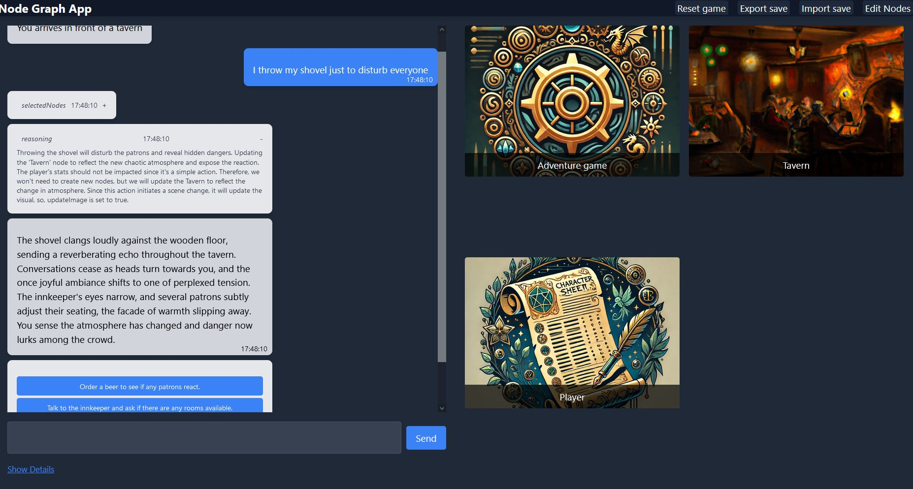

# Game Shaper AI

Interact with a Game-engine that keep building its rules and world as you play, adapted to your gameplay.

<p align="center">
    
</p>

We propose a node system that has few advantages over raw LLM gaming:
- Token-saving features to keep the API costs lowers, as large stories can easily scale in content. the AI only retrieves the content from the nodes it needs, while keeping a short context of all the available nodes
- UI to inspect any node in your game, with the possibility to store an image for each
- Adapt nodes as you play, or create game templates. Export your game stat at any moment to share the state of your gameplay and see how others diverge from it, or prepare a set of rules from scratch.




## External tools
### OpenAI
You can specify in the .env your API key and the model to use for image generation
[Sample .env](#sample-env)


### Stable Diffusion (Automatic1111)

Start your automatic1111 repository with the following argument:

```
--listen --api --api-log --cors-allow-origins "*" --ckpt yourmodel.safetensors --port 7860 --opt-sdp-attention
```

### KoboldCPP

Example launch argument for running Higgs-Llama-3-70B.Q4_K on 2 RTX 4090
```
./koboldcpp --port 5001 --usecublas --model ./model/Higgs-Llama-3-70B.Q4_K.gguf --flashattention --quantkv 0 --gpulayers 81 --contextsize 2048 --password nodegame
```

## Sample .env
VITE_OAI_KEY=# Open ai api key

VITE_LLM_API=koboldcpp #can be koboldcpp or openai
VITE_LLM_HOST=http://127.0.0.1:5001

VITE_IMG_API=automatic1111 #can be automatic1111 or openai (dalle-e)
VITE_IMG_HOST=http://127.0.0.1:7860
VITE_AOI_IMAGE_MODEL=dall-e-3